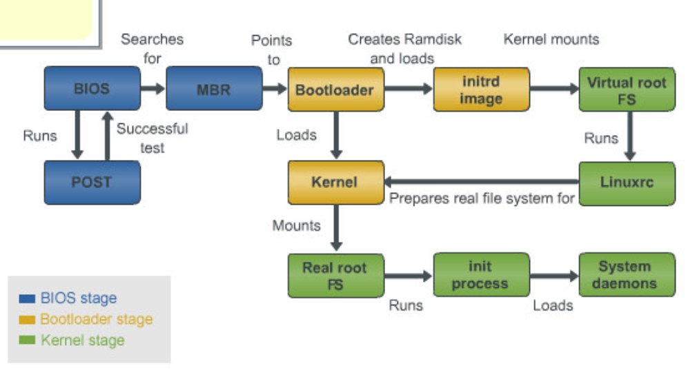
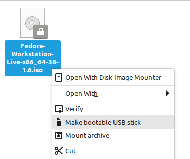

### File System Hierarchy (FHS)
The FHS is a standard describing the layout of Unix-like systems. Regardless of what distribution you are on, you will always encounter these same directories, so it is worth understanding. Throughout exploring these directories you will come to learn that in Linux,  *everying is a file*. Your entire memory is represented in a single file as `/dev/mem`.  Each ongoing process is represented as a directory with associated files in `/proc`, and so on. Learning these directories and their role in the FHS is fundumental to Linux and give you foundation for the rest of the sections.

Try listing (`ls`) each directory and explore on your own system.
```
ls /
	bin   cdrom   dev  home  lib32  libx32    media  opt   root  sbin  swapfile
	tmp  varboot   etc  lib   lib64  lost+found  mnt    proc  run   srv   sys   usr
```

##### /boot 
Upon starting a Linux system, after the BIOS or EUFI firmware has selected a boot device, such as a hard disk or SSD, it searches for a bootloader within that device inside the /boot directory. Grub (Grand Unified Bootloader) then uncompresses the `vmlinuz` executable file into memory. `vmlinuz` is an image of the entire kernel. compressed into one file. 

The next step after the kernel has been loaded into memory, is Grub handing over control to the kernel to complete the boot process. A temporary root file system is created with `initrd` (initial ramdisk) that contains just enough loadable modules to give the kernel access to the rest of the hardware. 

In many systems, boot is a seperate partition, you can check this by listing block devices with `lsblk`. You can see on my NVME card, it is indeed a seperate partition.
```
lsblk
NAME        MAJ:MIN RM   SIZE RO TYPE MOUNTPOINTS
nvme0n1     259:0    0   1.8T  0 disk 
├─nvme0n1p1 259:1    0   260M  0 part /boot/efi
```

##### /proc
The process directory contains a subdirectory for every ongoing process, similar to what is displayed in Windows Task Manager or Linux `top` command. The process with PID (process ID) of 1, `/proc/1`, is a special process know as the init process which is responsible for starting essential system services, and which all other processes are children of. This is often managed by `systemd`, replacing `init`. 

proc is one of the three virtual/psuedo filesystems as it creates files dynamically, on the spot to represent the current processes. 

Besides ongoing processes, the `/proc` directory also contains some kernel and hardware information. At one point in history, this got messy and Linux developers decided to create another directory `/sys` to contain this.

##### /sys
As the second virtual filesystem, sys generates files and directories to represent the current hardware layout. This provides an interface to the kernel.

```text
ls sys
block  bus  class  dev  devices  firmware  fs  hypervisor  kernel  module  power
```

##### /var
`/var` contains variable data that is expected to change and grow during operation. This includes log files, mail, cache and more. `var/spool` contains files waiting to be excecuted such as printer ques and cron jobs. `/var/lib` contains state information of applications or the system, this is data that programs modify as they run, this is often for preserving condition of an application between instances. `/var/tmp` is for temporary files that persist across reboot. Unlike `/tmp` which is removed after a reboot.

```text
ls var
backups  cache  lib  local  lock  log  mail opt  run  spool  tmp
```

##### /usr
`/usr` contains user-related data, programs and resources. Files not necessary for single user mode, a minimal system state for troubleshooting and maintenance. Most command's binaries that are commonly ran in the terminal are within `/usr/bin`.  These are commands considered non-essential, as opposed to built in shell commands. 

```text
which cd
cd is a shell builtin

which ls
/usr/bin/ls
```

`/usr/local` contains locally installed software and files that are seperate from the core operating system and package management system.

##### /lib, /bin and /sbin
`/lib` contains libraries for `/bin` and `/sbin`. sbin is essential binaries with superuser (root) priviledges. Bin is similar and contains trivial binaries such as `cat` and `ls` . Both are required for single user mode.  

##### /dev
`/dev` is the third virtual file system and contains a layout of devices. When you plugin a USB, it will appear as `/dev/sda`, if you plugin another, it will appear as `dev/sdb`. 

Most device files are either character or block type.  Using the long `-l` format of `ls`, we can see the type by the first letter. Character devices, which begin with a letter `c`, do not have buffering, and are accessed through a stream of sequential data, one byte after another. Block (`b`) devices are accessed through a cache, and get their name because they are often read/write to a block at a time.

The first special character device, `dev/zero`,  provides an endless stream of null characters, which can be used to zero out a hard disk. `dev/null` is essentially a black hole that discards anything directed into it. `dev/urandom` is a unlimited cryptographic (psuedo) random number generator.

```text
ls -l /dev
crw-rw-rw-   1 root root      1,     5 Oct 30 14:10 zero
crw-rw-rw-   1 root root      1,     3 Oct 30 14:10 null
crw-rw-rw-   1 root root      1,     9 Oct 30 14:10 urandom
```

Some use cases of `urandom` include generating passwords, and to generate entropy for TLS/SSL modules like `mod_ssl` on Apache web servers.
```bash
< /dev/urandom tr -dc _A-Z-a-z-0-9 | head -c12;echo
```

##### /etc
At some point in Unix history, this likely stood for "etcetera", though now some like to squeeze in the acronym "editable text configuration". Although most simply pronounce it "etsy" and know it as the place for configuration files. 

##### /opt
The FHS standard defines `/opt` as "software and add-on packages that are not part of the default installation". Often when a company is deploying an application, they have the option of either placing it all in one directory in `/opt/[application]` or share it's files across `/usr/local/bin` and  `/usr/local/lib`. 

### Boot Process
#### Step by Step Boot Process`

1. Firmware (UEFI/BIOS)
	- When you turn on a computer, the firmware built into the hardware initiates the boot process.
	- It performs a power-on-self-test (POST) to check hardware components and initialize them.
	- The firmware looks for a boot device, usually the hard drive or SSD, where the bootloader is stored.
2. Bootloader (GRUB)
	- Once the firmware identifies the boot device, it hands over control to the bootloader.
	- The bootloader loads the kernel into memory and passes control to it.
3. Kernel
	- The kernel is the core of the operating system. It initializes hardware, manages memory, and provides essential services to user programs.
	- It mounts the root file system, initializes drivers for hardware components, and starts user space initialization.
4. User Space
	- After the kernel initializes, it starts the user space by launching systemd (previously init). This is the first process and can be seen with `pstree` or `ps -p 1`.



Depending on the firmware (BIOS or EUFI), a hard disk or SSD will have 1 of 2 partitioning schemes, MBR or GPT.

Master Boot Record (MRB) is used in older systems that is the first 512 bytes of a storage device which contains how and where the operating system is located in order to be booted. Legacy BIOS systems using MBR can only support drives up to 2TB and up to 4 partitions.

The bootstrap binary of a BIOS equipped machine is located in the MBR of the first storage device.

GUID Partition Table (GPT) is the newer standard that works with UEFI that can have any number of ESP (EFI System Partitions) anywhere an a drive to load multiple operating  systems, unlike MBR, which is limited to one.  GPT also supports virtually unlimited size and up to 128 partitions.

EUFI boot process searches for EFI applications which are usually bootloaders, such as GRUB, which can either act as a EFI application or a BIOS bootloader for older setups. ESP is where EFI applications are stored and are automatically created on the storage device during OS installation.

Older BIOS systems often overwrited MBRs during installation of multiple OS's, GPT makes this easier becuase ESP can be located anywhere on the drive, they are not location dependent, like MBR, which must be at the first 512 bytes of the drive.

#### Boot Files and Commands

**mkinitrd** - creates an initial ram disk image `initrd.img` which is used by the kernel for preloading the block device modules (such as IDE, SCSI or RAID) which are needed to access the root filesystem. 
**dracut** -  a more modern alternative to `mkinitrd` 
**grub-install** - installs grub onto a device, usually `boot/grub`
**grub-mkconfig** - either generates a new `grub.cfg` file or updates the existing one also located in `boot/grub`
**grub-update** - stub for `grub-mkconfig -o /boot/grub/grub.cfg`

**initrd.img** -  initrd is mounted in memory to determine which kernel modules are are needed to support the current hardware. Explanation on [forum](https://www.linuxquestions.org/questions/linux-kernel-70/creating-vmlinuz-and-initrd-on-distribution-media-590730/#post2920395)
**vmlinuz** - the entire compressed kernel which is uncompressed and begins the initial systemd/init process, which starts all other processes
*Both are used both during the initial OS install, and every boot therafter*.

Note: `vmlinuz` kernel image is loaded first by the bootloader, followed by the `initrd`. The `initrd` serves as an intermediary step to initialize hardware and load necessary drivers before transitioning to the actual root file system.

`initrd` and `initramfs` are just two different methods of loading a temporary root file system into memory to start early kernel modules. 

**dracut** similar to initrd in providing an initial ramdisk during boot process and is a more modern and flexible tool that dynamically generates ramdisk images based on the system's hardware. It has replaced initrd in some distributions.

Here are two short descriptions of dracut from the [man](https://man7.org/linux/man-pages/man8/dracut.8.html) page and it's [github](https://github.com/zfsonlinux/dracut) repository repsectively:
"low-level tool for generating an initramfs/initrd image"
"a new initramfs infrastructure"

**Kernel Panic** - Critical error condition that usually results in the entire system becoming unresponsive and requiring a reboot. Nothing is userspace runs during and after the system panics, it will instead immediately shutdown all other CPUs, and the current CPU processing the panic will never return to userspace
#### Boot Sources
##### Preboot Excecution Environments (PXE)
PXE is meant for booting off of a network, as opposed to a local storage device. This is done through TFTP (Trivial File Transfer Protocol), a simpler FTP which does not require authentication,. Once connected, the server will tell the client where to locate the boot files. iPXE is the newer protocol which uses HTTP to pull files. PXE and iPXE are essentially just one approach to provisioning and automate the deployment of operating systems and configurations for servers.
##### Optical Disc Image (ISO)
ISOs are copies of of entire optical disks such as DVDs or CDs. Although bootable USB drives have largely replaced optical media, ISO files can still be used to create bootable USB sticks. The most common tool to create bootable drives is Rufus, although on my Linux Mint system below, I have downloaded a Fedora ISO, which I can create into a bootable stick from the file manager itself.



### Basic Package Compilation From Source
Although software is often installed with a package manager (APT, RPM, etc.), there are times when it is necessary to install from source code. This could be when you are writing the software yourself, or the software is not listed in your package manager's repositories. 

Linux distros rarely come with the compiling/build tools themselves. To install on Debian based distros, run `sudo apt install build-essential` or `sudo dnf groupinstall "Development Tools"` on Red Hat based distros. These both install a set of essential development tools and libraries necessary for building software from source code.

The following three commands are commonly used together and in this order to build and install software from source code on Unix-like systems.
#### ./configure
Configures the software build process. It checks the system for dependencies, sets build options, and generates a Makefile from Makefile.in that contains instructions for compiling the software.
#### make
running `make` will use the Makefile to build the program. It compiles the source code and produces executable binaries. I recommend running `man make` and digging around, here is a snippet:
```text
The  make  utility will determine automatically which pieces of a large program need to be 
recompiled, and issue the commands to recompile them. ...  Our examples show C programs, since
they are  very  common,  but  you can use make with any programming language whose compiler 
can be run with a shell command.  In fact, make is not limited to programs.  You can use it to
describe  any task  where  some  files  must  be  updated  automatically from others whenever
the others change.
```
#### make install
 This command will also use the Makefile but will use it to install the program once it has been compiled. This involves installing binaries, libraries, and other necessary files to make the software available to use.

#### Example
To practice these commands, you can go to [gnu.org](https://ftp.gnu.org/gnu/hello/) and download the hello-2.12.tar.gz at the very bottom.

You can extract the file with `tar -zxvf [file]`. The `z` flag is for g-zipped files, hence the `.gz`. `x` for extract, optional `v` for verbose output, and `f` to specify the file. This should create a directory of the extracted files.

Once in that directory, `ls` to make note of the file `configure` , then run `./configure` to execute it. Now with a `makefile`, run `make`. This should create an executable `hello` which can be ran with `./hello`. You should get a "Hello World!" output on your terminal. But to install the program globally, run `sudo make install`, this will install the package's files in
`/usr/local/bin`, `/usr/local/lib`, `/usr/local/man`, etc. 

```
❯ sudo make install
[sudo] password for promptier:     
./mkinstalldirs /usr/local/bin /usr/local/info
mkdir /usr/local/info
/usr/bin/install -c hello /usr/local/bin/hello
/usr/bin/install -c -m 644 ./hello.info /usr/local/info/hello.info
❯ hello 
Hello, world!
❯ which hello
/usr/local/bin/hello
```

### Basic Storage Concepts

#### Block Storage
- No Metadata, or very minimal (basic file attributes)
- Each block has a unique ID
- Filesystems are often built on top of blocks
- Accessed through iSCSI networking protocol, or traditional Fibre Channel which requires hardware (cables, adapters, switches, etc.). Read more [here](https://community.fs.com/article/iscsi-storage-basics-plan-iscsi-san.html)
- Used in SANs (Storage Area Network) or cloud based storage
- highly performant and scalable, though expensive
- Examples include relational databases, email servers and VMWare's Virtual Machine Filesystem (VMFS)

#### Object Storage
- Relatively new concept, often used in the cloud, Amazon S3 is a common example.
- Often accessed through an API.
- stored in "data lakes" or "data pools" in a flat manner, with no file hierarchy.
- ease of searchability and cost efficient. Best for large unstructured data.
- each object has metadata (size, date modified, permissions, etc.) and an UUID.
- poor performance because of the heavy metadata overhead
#### File Storage
- Oldest and most widely used storage system
- Used with NAS (Network Attached Storage)
- Tree-like, hierarchical structure with files within nested folders, each being a child or parent
- Not very scalable.
- Can be visualized with the `tree` command. 
```
tree
.
├── Desktop
│   ├── bash
│   │   ├── dep.txt
│   │   ├── folders.sh
│   │   └── tar
│   │       ├── file1
│   │       ├── file2

```
### Filesystem in Userspace (FUSE)
Used to mount and unmount filesystems in userspace without requiring root level, kernel access. Commonly used by `sshfs`, a tool to mount a remote filesystem using SFTP. Another example that uses FUSE are [[1.6 Package Management and Sandboxed Apps#Appimages|Appimages]]

From the man page of `fusermount`
```
Simple interface for userspace programs to export a virtual filesystem to the Linux kernel. 
It also aims to provide a secure method for non privileged users to create and mount their 
nown filesystem implementations.
```

### RAID
RAID stand for *Redundant Array of Independent/Inexpensive Disks*. RAID gives a group of hard drives or block storage devices redundancy and data protection against disc failure. Different RAID levels offer different degrees of fault tolerance.
[Animated Video Explaining RAID 0, 1 and 10](https://www.youtube.com/watch?v=U-OCdTeZLac)

**Raid 0**
- Isn't even RAID in a sense, as it provides *zero* fault tolerance
- Raid 0, or "disk striping", splits data across drives evenly.
- With 4 drives and a 4 megabyte file being saved, 1 megabyte per drive is spread across and thus increases speed. This also means each drives space is being taken advantage of.
- Very fast but if even one drive fails, all data is lost, this means RAID 0 isn't just not fault tolerant, it increases the chances of data loss.

**Raid 1**
- Known as "mirroring", data is stored on a drive in addition to each mirror drive. Atleast 2 drives are required for RAID 2
-  A drive can fail and the controller will just use either use the first drive or any of it's mirrors for data recovery and continuous operation.
- A disadvantage is less effective storage capacity as all data gets written at least twice

**Raid 5**
- RAID 5 stripes data across each drive and provides fault tolerance with each drive having a parity.
- Each parity is equivalent to an entire drive, meaning if you have 4 disks totaling 4 terabytes, only 3 terabytes will be used for actual data storage. 
- Can only handle 1 disk failure at a time

**Raid 6**
- A more fault tolerant RAID 5 that can handle 2 disk failures at once as parity is spread twice to all disks.
- Minimum of 4 disks required.
- In a setup of 4 disks totaling 4 terabytes, only 2 terabytes of actual data storage is available, as 2 disks are used to store a double parity.
- Read performance is the same as RAID 5, but write performance is slower as it must write double the parity blocks instead of 1.
[Animated Video of RAID 5 and 6](https://www.youtube.com/watch?v=UuUgfCvt9-Q&t=3s)

**Raid 10**
- 2 drives are mirrored in a RAID 1 setup, with a minimum of 4 drives.
- Combines the fault tolerance of RAID 1 and the speed of RAID 0
- The downside is you can only use 50% of space for actual storage, the other half is mirrored.
### Listing Hardware Information

Linux Kernel Modules related to hardware devices are also called drivers. `lspci` will list your PCI devices, each starting with a  unique address, which more info can be found with `lspci -s [address] -v OR -k`. This will show what kernel module is in use which can be found in `lsmod`.

To find you network card, pipe the output of `lspci` into `grep -i` for an insensitive search.
```
lspci | grep -i network
03:00.0 Network controller: MEDIATEK Corp. MT7921 802.11ax PCI Express Wireless Network Adapter
```

Now let's see what kernel modules the network card is using with the verbose `-v` output.
```
lspci -s 03:00.0 -v
03:00.0 Network controller: MEDIATEK Corp. MT7921 802.11ax PCI Express Wireless Network Adapter
	DeviceName: Realtek RTL8111E Ethernet LOM
	Subsystem: Lenovo Device e0bc
	Physical Slot: 0
	Flags: bus master, fast devsel, latency 0, IRQ 73, IOMMU group 11
	Memory at fc02000000 (64-bit, prefetchable) [size=1M]
	Memory at fc02100000 (64-bit, prefetchable) [size=16K]
	Memory at fc02104000 (64-bit, prefetchable) [size=4K]
	Capabilities: <access denied>
	Kernel driver in use: mt7921e
	Kernel modules: mt7921e
```
We could then use `lsmod` to find more about the kernel module, such as the size and other modules that are dependent on it.
```
lsmod | grep mt7921e
mt7921e                94208  0
```

`lsusb` is similar to the previous command. With option -t, command lsusb shows the current USB device mappings as a hierarchical tree. A specific USB device can be found with the `-d` flag followed by the id.

```bash
lsusb -vd 1d6b:0003

[very verbose output]
```

`dmidecode` is a tool for dumping a computer's DMI table contents in a human readable from. This includes detailed hardware information as well as serial numbers and BIOS revision that does not require probing the actual hardware. Use the type flag `-t` to specify what hardware, such as `dmidecode -t memory` or `dmidecode -t processor`.

Here are some output from `dmidecode` from my computer.
```
BIOS Information
        Vendor: LENOVO
        Version: H3CN32WW(V2.02)
        Release Date: 02/23/2022
        BIOS Revision: 1.32
        Firmware Revision: 1.32

Handle 0x0001, DMI type 1, 27 bytes
System Information
        Manufacturer: LENOVO
        Product Name: 82K2
        Version: IdeaPad Gaming 3 15ACH6
        Serial Number: MP2BK1DS
        UUID: 1c45bdff-12cd-11ed-8c90-e4a8dfe66d9e
        
Handle 0x0004, DMI type 4, 48 bytes
Processor Information
        Socket Designation: FP6
        Type: Central Processor
        Family: Zen
        Manufacturer: Advanced Micro Devices, Inc.
```
