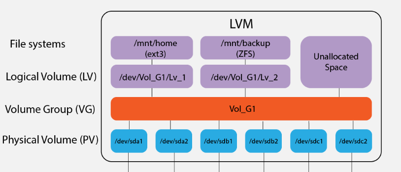

Shawn Powers Links
[Archiving & Compressing (tar, gzip, cpio)](https://www.youtube.com/watch?v=G-pDsE8KVwo&list=PL78ppT-_wOmuwT9idLvuoKOn6UYurFKCp&index=9)
[Copying Between Networks (scp, rsync, nc)](https://www.youtube.com/watch?v=ciBzbKspfK8&list=PL78ppT-_wOmuwT9idLvuoKOn6UYurFKCp&index=10)

#### Systemd and fstab File System Mounting
The traditional way for auto-mounting filesystems is `/etc/fstab`. However, a more modern method with more flexibility is to create systemd unit files in `etc/systemd/system`. This allows more granular control over each mount point and allows dependency management between units, so you can control the order of mounting. It is also the preferred method for more complex and network-mounted filesystems.

It is worth noting that systemd automatically generates `.mount` and `.automount` files from  `/etc/fstab` anyways. This simplifies the process of managing mounts, as you don't need to manually create systemd unit files for each mount point. Instead, you can continue to use the familiar `/etc/fstab` syntax and systemd handles the unit generation behind the scenes.

Overall, `/etc/fstab` is an older and traditional way of configuring file system mounts in Linux, which systemd is still compatible with. Both methods are popular with `etc/fstab` preferred for simple mounts and manual systemd unit files preferred for more complex configurations.  

Both are similar in displaying, *what* to mount, *where* to mount it, the *type* of filesystem, and any additional options.

`/etc/fstab`
```
# <file system> <mount point>   <type>  <options>       <dump>  <pass>
UUID=df155a8b-6b89 /               ext4    errors=remount-ro 0       1
UUID=E89D-9509  /boot/efi       vfat    umask=0077      0       1
/swapfile                                 none            swap
```

`/etc/systemd/system/mnt-data.mount`
```
[Unit]
Description=Data mount

[Mount]
What=/dev/disk/by-uuid/filesystem_UUID
Where=/mnt/data
Type=xfs
Options=defaults

[Install]
WantedBy=multi-user.target
```

#### LUKS and Cryptsetup
Still working on this one.

```
sudo cryptsetup luksFormat /dev/sda
[sudo] password for promptier:     
WARNING: Device /dev/sda already contains a 'dos' partition signature.

WARNING!
========
This will overwrite data on /dev/sda irrevocably.

Are you sure? (Type 'yes' in capital letters): 
```

#### LVM
3 Components
1. Physical Volumes (pvs)
2. Volume Groups (vgs)
3. Logical Volumes (lsv)

2 have counterparts to traditional disk partitioning

|Disk Partitioning System|LVM|
|---|---|
|Partitions|Logical Volumes|
|Disks|Volume Groups|

First you create physical volumes
```
❯ sudo pvcreate /dev/sda1
  Physical volume "/dev/sda1" successfully created.
❯ sudo pvs
  PV         VG Fmt  Attr PSize   PFree  
  /dev/sda1     lvm2 ---  <28.91g <28.91g
```

Now volume groups are collections of physical volumes.

To add or remove physical volumes from logical volumes, use extend and reduce.
```
vgextend <volume_group> <physical_volume1> <physical_volume2> ....

vgreduce <volume_groupe> <physical_volume1> <physical_volume2>
```

Finally, logical volumes are created from volume groups.

```
sudo lvcreate -L <size> -n <lvname> <vgname>
```

physical volumes > volume groups > logical volumes

1. create physical volumes from multiple devices
```shell
sudo pvcreate /dev/sdc /dev/sdd
```
2. next create a volume group using multiple physical volumes
```shell
sudo vgcreate lvm_tutorial /dev/sdc /dev/sdd
```
3. finally create a logical volume from a volume group
```shell
sudo lvcreate -L 5GB -n my_lvm lvm_tutorial
```


#### Filesystems
DJWare Benchmarks and Comparison [video](https://www.youtube.com/watch?v=G785-kxFH_M)

Problems that were solved at Facebook data-centers by switching to BTRFS in this [article](https://facebookmicrosites.github.io/btrfs/docs/btrfs-facebook.html). BTRFS provided efficient container isolation, reducing IO and CPU expenses, and enabling advanced features like snapshotting and transparent file compression.

Though the upstream Fedora Project uses BTRFS, REHL 9 uses XFS by default. This Reddit [thread](https://www.reddit.com/r/redhat/comments/qnd75q/why_no_btrfs_default_for_rhel_9_at_least_for/) is very informative, which a Lead Engineer at Red Hat responds.

Recent [thread](https://access.redhat.com/discussions/3138231) in Red Hat forum concerning filesystem usage in Red Hat and Suse.

OpenSuse and SLES typically use Btrfs as the default file system for the root partition due to its advanced features like snapshots, rollbacks, and data deduplication. For other partitions, such as `/home` or data partitions, XFS is commonly recommended due to its stability and performance, especially when dealing with large files. This approach combines the advantages of both file systems: Btrfs for system file management and rollback capabilities, and XFS for high-performance data storage.

Debian and Ubuntu use EXT4 as their default filesystem.