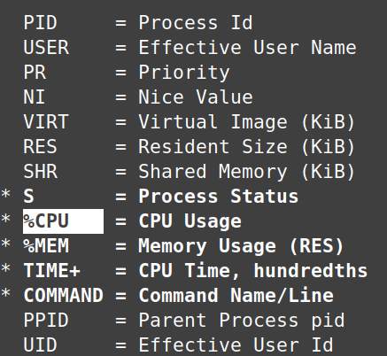

#### Systemctl
The `systemctl` program inspects and manages the`systemd` system and service manager. Systemd runs as your your very first process (PID 1) on boot, which spawns all other processes. 

`systemd status` will display all ongoing systemd services which can be narrowed down with `{service-name}`, such as the following.

```
~$ systemctl status cron
● cron.service - Regular background program processing daemon
     Loaded: loaded (/lib/systemd/system/cron.service; enabled; vendor preset: enabled)
     Active: active (running) since Mon 2023-11-13 07:13:26 CST; 2h 31min ago
```

Each of these services are contained within control groups (cgroups) to isolates resource usage of a collection of processes. Very similar to `systemd status`, `systemd-cgls` will list all control groups in a more concise format. `systemd-cgtop` will list control groups by resource usage, similar to `top`.

To manage these services, use `systemctl enable` and  `disable` for automatic starting or preventing the service at boot. Use `start` and `stop` to do this manually for immediate action. A more drastic action is `mask`, which prevents the service from starting on boot and manually starting by creating a symlink to `/dev/null`, this effectively discards any attempt to start the unit. As an example, if you have a legacy service (`old-service.service`) that should never be started again and should be completely removed from the system. Masking ensures that even if someone tries to start it manually, systemd will ignore it.

#### Process Management

##### Kill Signals
You can  list all possible kill signals with `kill -l`, here are four common ones with there name and associated code to be called with `kill`.

**SIGHUP - 1** Originating from the concept of a "hangup", or when a something like a modem disconnects from a console, this signal now mostly refers to a program losing connection to the controlling terminal (tty).  Any program started in a given terminal will receive a SIGHUP when the terminal is closed. Besides terminals, daemons (being detached from the terminal) use this signal by convention to reread config files.

**SIGINT - 2** Signal interrupt is what occurs when `ctrl + c` is pressed during a running process. It is essentially a interruption request sent by the user.

**SIGKILL - 9** Instructs the process to terminate immediately. It cannot be ignored or blocked. This is the most powerful signal and can have unintended consequences.   

**SIGTERM - 15** Signal terminate tries to kill the process, but can be blocked or handled in various ways. It is a more gentle way to kill a process.

**SIGCONT - 18** Continue a process after having been paused with SIGSTOP

**SIGSTOP - 19**  This pauses a foreground process, which is one that controls the tty and is currently being displayed in the terminal. `ctrl + z` will trigger this signal and bring the process the the backround. The process can be brought back the the foreground with `fg`. 

Let's run a sleep command to start a running process in the foreground, pause it, find it's PID, then kill it. Keep in mind `kill -9` is equivelent to `kill -SIGKILL` and so forth.

```
❯ sleep 200
^Z
[1]+  Stopped                 sleep 200

~ took 3s 
✦ ❯ ps
    PID TTY          TIME CMD
   8305 pts/0    00:00:00 bash
  11615 pts/0    00:00:00 sleep
  11645 pts/0    00:00:00 ps

~ 
✦ ❯ kill -9 11615
```

Alternatively, we could have induced `SIGINT` with `ctrl + c` to interupt the process, or brought back the backround process to our terminal with `fg`.

Commands to find PIDs by name include `pgrep` and `pidof`. They are similar except pidof only returns the exact match of the name, while pgrep includes partial matches. 

In this example, pidof returns only the exact match called `systemd`, while pgrep returns programs including `systemd-journal`, `systemd-logind`, etc.
```
❯ pidof systemd
1779

❯ pgrep systemd
1
460
495
892
1779
```

The the `kill` program requires the exact PID, there are two programs which take names as arguments. Comparable to pgrep and pidof, `pkill` and `killall` work with partial names and exact names respectively. In this example, pkill will forcibly kill all programs with matching "obsidian" including partial matches. killall will only kill programs with the exact name of "obsidian".
```
❯ pkill -9 obsidian
❯ killall -9 obsidian
```

Here I pause (SIGSTOP) and resume (SIGCONT) my file manager, Nemo, on Linux Mint. After I pause it, the application's window is basically frozen, then I resume it. 
```
❯ pkill -19 nemo

❯ pkill -18 nemo
```
##### Process States
|Process State|PS Representation|
|--|--|
|Running|R|
|Idle|I|
|Stopped|T|
|Sleeping(Int)|S|
|Sleeping(UnInt)|D|
|Zombie|Z|

These process states can be seen with `ps` and `top`. Processes that are stopped can be though of as paused, this is what happens with `ctrl + c` sending the SIGSTOP signal, which can be resumed with SIGCONT. Most processes seen with `top` are either running (S), idle (I).

Interruptible sleep (S) is sensitive and waiting for user space signals. Uninterruptible sleep (D) waits for a specific system call (usually disk I/O) and cannot be interrupted or killed until the call is complete.

Zombies (Z) are dead processes whose parent has not destroyed them properly. They do not use any resources but can pollute output in `ps` and `top` and should be cleaned up.

`jobs` views and manages background jobs within the current shell session. `sleep` is an easy command to experiment with. After sleeping for a set amount of time, the process can be paused (SIGSTOP) with `ctrl + z` or immediately brought to the backround with `&`.
```
~$ sleep 10
^Z
[1]+  Stopped                 sleep 10

~$ sleep 20 &
[2] 3967600
```
View current jobs with `jobs` and bring one back to the foreground with `fg [id]`. By default `fg` will run the job marked with a `+`.
```
~$ jobs
[1]-  Stopped                 sleep 10
[2]+  Stopped                 sleep 20

~$ fg 1
sleep 10
```

`ps` is a more general process monitoring tool for the whole system. Instead of viewing jobs only in the terminal session, you can detach from the terminal with the `x` flag and specify options/columns with `-o`. Here I only care about the PID and state.

```
~$ ps -x -o pid,state
    PID S
   1259 S
   1260 S
   1267 S
```
##### Nice and Renice
Nice is intended for batch or background jobs. Jobs are niced (given lower scheduling priority) so they don't use CPU when online users need it, and so foreground tasks have ample performance.

Niceness value refers to CPU priority of userspace programs on a scale of -20 to 20, lower being higher priority. Use `nice` to launch a program with a specific niceness value, and `renice` to alter the priority of a currently running process. 

Here I launch my terminal with a relatively low priority of 10. Then I alter it's nice value to an even lower priority. 

```
❯ nice -n 10 gnome-terminal
❯ renice -n 15 9830
```

Keep in mind in order launch a program with high priority (below 0), you need root privilege. In the same manner, root privileged is also needed to increase a current running program's priority. 
#### top
Top is the default resource moniter preinstalled on nearly all Linux systems. You can think of it as a lightweight, terminal based Task Manager from Windows. Before jumping into it, you can list the running processes manually as well as find uptime and load average with simpler commands.

The `ps` command by default will list out procceses ran in the terminal. The `x` flag lifts the restriction of the terminal and displays all ongoing processes in the system. The `u` flag adds a user column.

```
❯ ps aux
USER         PID %CPU %MEM    VSZ   RSS TTY      STAT START   TIME COMMAND
root           1  0.0  0.0 166648 12088 ?        Ss   07:23   0:01 /sbin/init splash
root           2  0.0  0.0      0     0 ?        S    07:23   0:00 [kthreadd]
root           3  0.0  0.0      0     0 ?        I<   07:23   0:00 [rcu_gp]
```

We can also find uptime and load average with `uptime` or `cat /proc/loadavg`. These are explained below.
```
❯ uptime
 10:05:42 up  2:42,  1 user,  load average: 1.51, 1.13, 0.92

~ 
❯ cat /proc/loadavg 
1.46 1.12 0.92 1/1319 13289
```

For a more dynamic listing of this data, we can run `top`. You can think of this which as essentially running commands like `ps aux`, `uptime`, `free` for memory, and additional commands every three seconds, to actively moniter the system.


##### Statistics
 Starting with the statistics at the top, starting from the left, you can see the up time, which is how long the system has been running. Moving right, the number of users is displayed, then we have load average, which is average CPU usage in the past 1 minute, 5 minutes, and 15 minutes. It is  based on your number of cores. For example if you have 4 cores, then a 4.0 would mean 100% CPU usage, in this screenshot, I have 2 cores so in the past 1 minute I had 63% usage of my 2 cores.
##### Process Table
Now, let's go over each column in the process table.

- **PID**: Process ID.
- **USER**: The user running the process.
- **PR**: Priority of the task computed by the kernel on a scale of 20 to -20.
- **NI**: "Niceness" value, which involves the priority of user processes. 0 is the default and highest priority.
- **VIRT**: Virtual and physical memory, representing the total memory space allocated to a process, including RAM and swap. It's like a hypothetical maximum needed by the program. RES + Swap space = VIRT
- **RES**: Resident (Physical) memory used by the process. VIRT - Swap space = RES
- **SHR**: Shared memory.
- **S**: State of the process, where "R" means running, "S" means sleeping, and "I" is idle.

To only display columns that matter to you, you can press `f` while in top for field management. In this case I only care about process state, cpu, memory, how long the process has been running, and the command name.

Navigate with the arrows and select fields with the spacebar.

Now I have a much more minimal process table with only the fields I care about.

##### htop
The most popular alternative, `htop`, provides more customization, scrolling and mouse support, color, and an overall cleaner interface. Unlike `top`, it does not come preinstalled but is worth checking out with a quick download.
```
sudo apt install htop
```
I recommend to learn `top` first and then try out `htop`, comparing the two. 

Upon running `htop`, you will first realize the displayed columns discussed above are exactly the same, as well as the tasks, load average, and up time at the top right. The main difference is the colorful, more readable TUI (text user interface) that supports mouse events and scrolling. An example of this is the CPU column, colored blue after clicking, ordering the processes by CPU consumption. 

![[htop.jpg]]
