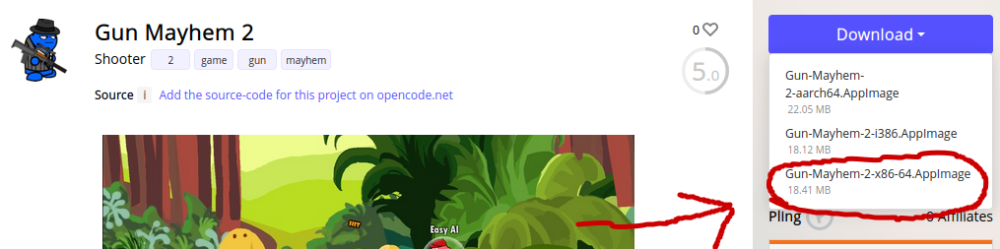
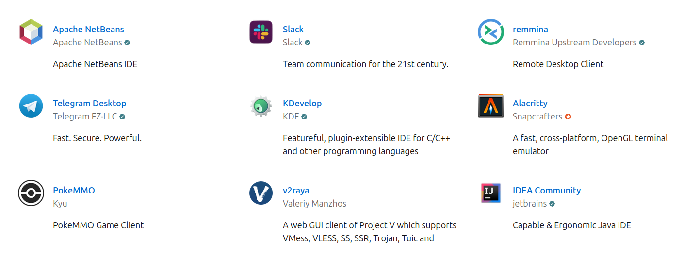

#### Package Management
In the old days of Linux in the 90s, installing packages was only possible with tools like `dpkg` (Debian Package) and `rpm` (Red Hat Package Manager), which each install a single binary at a time. This meant you had to hunt down each remaining `.deb` or `.rpm` package dependency yourself. These would now be considered low-level package managers, since the creation of tools like `apt` (Advanced Package Manger) on Debian and Ubuntu, as well as `yum` and `dnf` on Red Hat. As high-level package managers, they will automatically resolve dependencies, often installing many packages at once for a single program. Additionally, these tools provide automatic updates and generally simplify the software installation process.

These tools work by reading from a public database of packages called repositories. We can see the number of packages in the Apt repository with the word count program to count each line/package. As you can see, we have over 80 thousand packages to choose from.
```
❯ apt list | wc -l
81413
```
This package management system is not just for Linux Administration, but for software development across programming languages as well. Javascript has the Node Package Manager (NPM) which is a cornerstone for web development, while  Python has PIP (Package Installer for Python), which grabs packages from the Python Package Index (PyPi).

Returning to Debian and Red Hat package managers, both `dpkg` and `rpm` have the same `-i` flag for installing.
```
❯ dpkg -i package.deb
OR
❯ rpm -i package.rpm
```

`yum` is the older package manager for Red Hat, with `dnf` (Dandified Yum) being the modern tool which includes more features such as rollback and undo.


Here is a great [article](https://blog.tidelift.com/a-brief-history-of-package-management) about the history of package management.

#### Sandboxed Apps
##### Appimages
Appimages are an entire app and all dependencies contained within a single file. This means there is no intermediary between the author and the user, such as required runtimes for Flatpacks and Snaps They are simple, distribution agnostic and do not require root. This is because appimages use FUSE (File System in Userspace), a system which allows non-root users to mount filesystems.

To run an appimage, simply download an app from [Appimagehub](https://www.appimagehub.com/), give executable permissions with `chmod +x` and run.

In this example, going to download [Gun Mayhem 2](https://www.appimagehub.com/p/2013542).


Once it's in my downloads folder, I'll give it executable permissions and play!
```
❯ chmod +x Gun-Mayhem-2-x86-64.AppImage 
❯ ./Gun-Mayhem-2-x86-64.AppImage 
```

Now while the game is running, let's look at the temporary filesystem created with FUSE that the game is running on. We can see it is in a read-only (ro) mode for execution, ensuring isolation and security during its runtime. Once you close the AppImage application, this temporary filesystem will be unmounted automatically.
```
❯ mount | grep Gun-Mayhem
/home/promptier/Downloads/Gun-Mayhem-2-x86-64.AppImage on /tmp/.mount_Gun-MaPpsVle type fuse.Gun-Mayhem-2-x86-64.AppImage (ro,nosuid,nodev,relatime,user_id=1000,group_id=1000)
```
##### Flatpaks
Flatpaks isolate applications in a 'sandbox' by providing separate runtimes/platforms that are distribution agnostic. On my Linux Mint system, I run many applications in flatpaks for the sandboxed security and automatic updates they provide. List running flatpaks `ps`.

```
❯ flatpak ps
Instance   PID  Application           Runtime
169358187  6282 com.brave.Browser     org.freedesktop.Platform
2422727375 6242 com.brave.Browser     org.freedesktop.Platform
2148086033 3309 md.obsidian.Obsidian  org.freedesktop.Platform
3377083729 3268 md.obsidian.Obsidian  org.freedesktop.Platform
739023738  2990 com.obsproject.Studio org.kde.Platform
```
 To find more information about a particular application, use `info`.
 ```
 ❯ flatpak info com.brave.Browser 

Brave Browser - The web browser from Brave

          ID: com.brave.Browser
         Ref: app/com.brave.Browser/x86_64/stable
        Arch: x86_64
      Branch: stable
     Version: 1.60.114
     License: MPL-2.0
      Origin: flathub
  Collection: org.flathub.Stable
Installation: system
   Installed: 368.6 MB
     Runtime: org.freedesktop.Platform/x86_64/22.08
         Sdk: org.freedesktop.Sdk/x86_64/22.08

```

Whether an app is currently running or not, I can list all installed flatpaks with `list`. 
```
❯ flatpak list
Name                    Application ID                  Version           Branch      Installation
Brave Browser           com.brave.Browser               1.60.114          stable      system
Discord                 com.discordapp.Discord          0.0.35            stable      system
OBS Studio              com.obsproject.Studio           30.0.0            stable      system
Visual Studio Code      com.visualstudio.code           1.84.1-1699275408 stable      system
Obsidian                md.obsidian.Obsidian            1.4.16            stable      system
```

[Flathub](https://flathub.org/) is the official distribution service for Flatpaks and provide easy installation of your favorite apps. In recent years, Flatpak has become a standard method of distributing software on Linux desktops


Besides the Linux desktop, Flatpaks are are often used for distributing applications on servers as well.
##### Snaps 
Developed by Canonical as the standard software packaging and deployment method on Ubuntu, Snaps are comparable to Flatpaks as self contained, sandboxed apps. Like Flathub, the [Snapstore](https://snapcraft.io/store) is the official  distribution service for snap packages. 

Though very popular now on Ubuntu desktop, Snap packages are primarily to distribute software across servers running Ubuntu. 