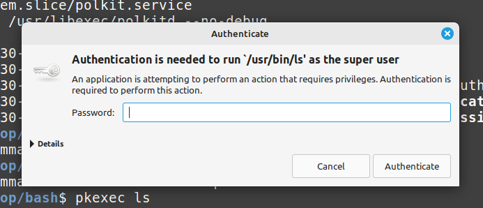

#### SSH
##### History and Overview
SSH is a protocol developed by a Finnish researcher in 1995 after his university was attacked by a password sniffer. At the time insecure protocols like telnet were used. SSH encrypts all data over a network, so hackers can't do any sniffing.

Two things are needed to connect, username for which user you want to login as, and the server host, which can either be an IP address or domain name. 
```
ssh username@serverhost
```

##### Key Based Authentication
By default, a server will have password-based authentication. Key-based authentication is recommended with a public and private key.

`ssh-keygen` is primarily used on the client to generate key pairs for authentication when connecting to servers.

ed25519 is the recommended algorithm for SSH key generation. As of OpenSSH 9.5 ed25519 is used by default for `ssh-keygen`

```
ssh-keygen -t ed25519 -f ~/.ssh/[filename] C "[Comment]"
```

An optional passphrase will be presented.

This will create both `filename.pub` with the public key and comment, as well as `filename` which will contain the private key.

Now the public key needs to be sent to the server with `ssh-copyid`.
`-i` is for identify file.
```
ssh-copyid -i ~/.ssh/filename.pub joseph@x.x.x.x
```
This will ask for the password, then add the client's public key to the servers `~/.ssh/authorized_keys` for easy login thereafter.

The client's `~/.ssh/known_hosts` file contains fingerprints of servers public keys so that it can recognize them as trusted for future logins.

If you have your keys generated and able to login with the machines you want, you should then disable password-based SSH authentication on the server. 

This is the server's system-wide sshd config file 
```
sudo vi /etc/ssh/sshd_config
```
Change or uncomment these
```
PasswordAuthentication no
PubkeyAuthentication yes
PermitRootLogin no
```
now reload the ssh deamon
```
sudo systemctl reload sshd
```

Now if you try to SSH into the server on any machine, it will be denied unless keys are generated and copied over like we did before.

Other security measures could be changing the SSH port away from the default 22.

`/etc/ssh/sshd_config` is the server config, and `/etc/ssh/ssh_config` is the client config

`ssh_config` often comes by default so any computer can act as a client easily. HOWEVER, most systems will not have an `sshd_config` by default. For a system to act as a server, it needs this file.

##### ssh-agent vs systemd sshd service
`ssh-agent` is a program for clients that stores private keys in memory and is used for public-key authentication. Keys are added using `ssh-add` or when it is automatically configured in `ssh-config`. SSH looks at the environment variables below and uses it to establish a connection.

Here is a look at one of my laptops which act as clients to connect ot my Ubuntu webserver.
```
❯ ssh-agent
SSH_AUTH_SOCK=/tmp/ssh-XXXXXXDHLZVi/agent.5315; export SSH_AUTH_SOCK;
SSH_AGENT_PID=5316; export SSH_AGENT_PID;
echo Agent pid 5316;

❯ ps aux | grep ssh
joe         4863  0.0  0.0   7972  1080 ?        Ss   11:08   0:00 ssh-agent
```

Now on the server side, here is my Ubuntu machine I use to run my Apache webserver. You can see the various Systemd services running to authenticate clients.
```
❯ systemctl status ssh
sshd-keygen.service  ssh.service          
sshd.service         ssh.socket      
```

So to summarize, `ssh-agent` is typically used on the client side to manage SSH keys, while SSH Systemd services like `sshd` are usually found on the server side to accept incoming SSH connections.
#### Executing commands as another user
##### Policy Kit and pkexec
Polkit is the "sudo of systemd". It defines the policy that allows unprivileged processes to speak to privileged processes, such as granting a user the right to perform some task in a certain context. Instead of granting root permission of the entire process, like `sudo`, polkit instead allows more fine grain control, such as privileges for certain situations or duration of time. 

As an alternative to running a command as root or superuser privilege, you can use `pkexec`. This is common for when you screw up your `/etc/sudoers` file.

It will prompt you for your password if on a text-based environment and window if in a graphical session.
```
❯ pkexec ls
==== AUTHENTICATING FOR org.freedesktop.policykit.exec ===
Authentication is needed to run `/usr/bin/ls' as the super user
Authenticating as: Jobo Baggins (joe)
Password: 
```

If failed, the incident will be reported and you can see the logs in `/var/log/auth.log`
```
Dec 13 18:32:47 statsfordevs pkexec[853597]: joe: Error executing command as another user: Not authorized [USER=root] [TTY=/dev/pts/0] [CWD=/home/joe] [COMMAND=/usr/bin/ls]
Dec 13 18:32:47 statsfordevs polkitd(authority=local): Unregistered Authentication Agent for unix-process:846897:34748679 (system bus name :1.156, object path /org/freedesktop/PolicyKit1/AuthenticationAgent, locale en_US.UTF-8)

```