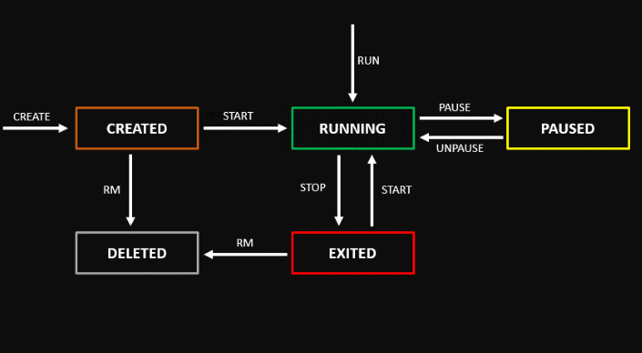

`docker run` = `docker create` + `docker start`

A stopped container can be restarted with `start`, unlike an exited container. `ps` will show only running containers, add the `-a` flag to include stopped ones. `docker ps -l` will who only the most recently created container, though in recent versions this may be `-n 1`, where you can manipulate the ouput, such as listing the last 5 created containers with `docker ps -n 5`. Use `-q` for "quiet" mode that will only list ids.
```
❯ docker ps -n 3 -q
f77c2b719993
5b0b857c73eb
807f5b547c1a
```
The main difference between the paused and stopped (exited) states is that **the memory portion of the state is cleared when a container is stopped, whereas, in the paused state, its memory portion stays intact**.

