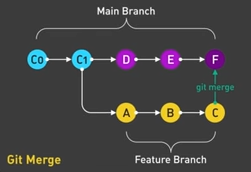
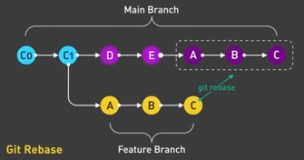

Recently, Github has changed the primary branch name from the traditional "master" to "main". This is becoming the new standard but they still refer to the same thing. 

`git branch [name]` - create new branch 
`git checkout [name]` - move to branch
**Pull Request** - Proposal to merge a set of changes from one branch to another, must be reviewed then approved. Often provided by hosting services like Github or Gitlab rather than a feature of Git itself. (Gitlab refers to them as Merge Requests) [fireship](https://www.youtube.com/watch?v=8lGpZkjnkt4)
**HEAD** - most recent commit

Say you've  been working on a new feature in a branch called `feaure`, once completed, you can checkout to the main branch and merge the changes.
```
git checkout main
git merge feature
```

##### Git Tags
By default, a tag will be *lightweight*, which includes no metadata. Make it annotated with the `-a` flag to include who tagged it and when. These annotated tags are considered best practice as it is nice to know when a version was released and who released it.

Include a message with `-m` or it will launch an editor for you to do it anyways.
```
git tag -a v1.0 -m "first release"
```
Then you can see the release info with `git show v1.0`


##### Rebase
Git rebase is an alternative to merge as a tool for integrating changes from one branch to another. Unlike merge, rebase has powerful history rewriting features. This is to maintain a linear and project history or in other words, a clean commit history.

Note how the changes of the feature branch were moved on to the top of main. This flattens the history, removing unwanted entries.



The golden rule of git rebase is to **never use it on public branches**.

To delete a specific commit, rebase in interactive mode just before the commit you want to delete, then delete the line containing that commit.
```
git rebase -i <commit>~1
#or possibly
git reset --soft <commit>~1
```
#### Tips and Tricks
##### Add and Commit on One Line
```
git commit -am "Git Add and Commit Shortcut"
#or
git commit -all -m "Git Add and Commit Shortcut"
```

This is equivalent to
```
git add .
git commit -m "Your commit message"
```

##### Fix Previous Commit
If you made a commit but realized you made a mistake, you can ammed the commit with the following.
```
git commit --ammend -m "New message"
```

