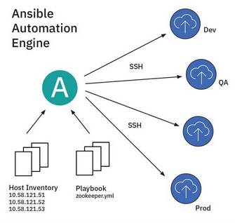
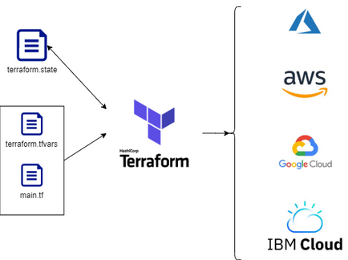
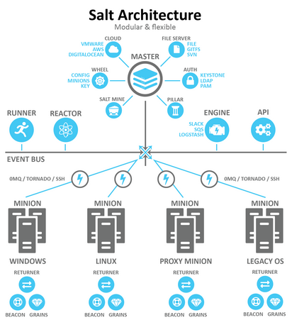
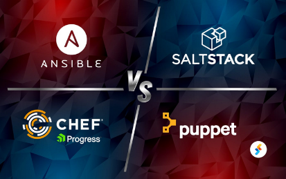
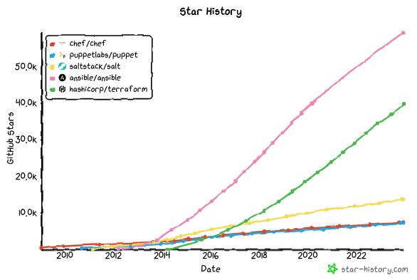
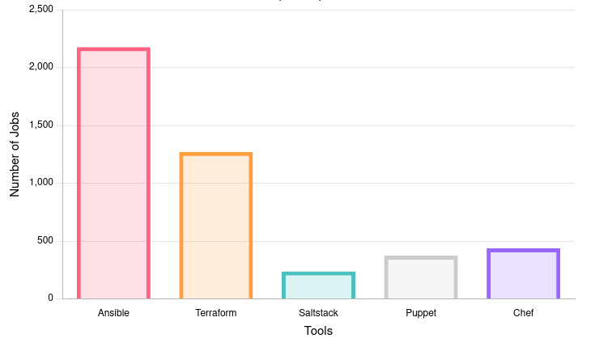

#### Utilities
##### Ansible
Uses playbooks written in YAML to automate Linux servers. One machine is a control node which sends the other managed nodes an Ansible module over SSH. Examples include updating network settings, provisioning databases, or any job you do more than once.

The machine acting as the control node runs the CLI tools such as `ansible-playbook [file].yml` which runs on all managed nodes, sometimes referred to as "hosts", which are your target devices (severs, network appliances, VMs, etc.). Ansible does not need to be installed on the managed nodes, only the control node. Hosts are defined in an inventory file.

The industry standard Ansible certification is the RHCE (Red Hat Certified Engineer). A prerequisite to this is the RHCSA (Red Hat Certified Systems Administrator), which is more comparable to the Linux+, except more geared towards RHEL distributions.
##### Terraform
Blueprints that automate everything you do in the cloud. Scripts are`.tf` files written in HashiCorp Configuration Language (HCL).

People commonly use both Ansible and Terraform together, with Terraform for provisioning, and Ansible for configuring. Though many tasks can also be completed on boot with cloud-init (such as SSH and key setup).

##### SaltStack
Salt is a configuration management and orchestration tool written in Python currently currently supported by VMware after it's acquisition. It came from the need for communication and task execution to many systems in complex data centers. It gives administrators the ability to manage massive infrastructure at scale using the Salt remote execution engine, which stores configuration (state) data accessed through YAML.

Salt is known for it's steep learning curve. 

Terraform was released in 2014 by Hashicorp under the permissive Mozilla Public License v2.0 (MPL 2.0) but recently changed the licensing to a Business Source License (BSL), which allows copying, modifying and redistribution, but restricts commercial use. This upset the community as the Open Source Initiative (OSI) definition of open source software does not discriminate against commercial venture. Rather than open source, it is more "source-available". As a response, the Linux Foundation created a fork of Terraform known as [OpenTofu](https://github.com/opentofu/opentofu) as an open source alternative.

##### Puppet and Chef
Two less common automation tools written in Ruby.

As a rule of thumb, whichever project has the cooler logo and has more Github star deserves more attention. In this case, Ansible is the clear winner.

##### Popularity and Employment Compared
Here are all the Infrastructure-as-Code tools popularity based on Github Stars. Ansible (pink) is by far the most popular followed by Terraform (green).

Here are the number of jobs listed from Glassdoor in the United States in the month of November, 2023 mentioning these tools.
